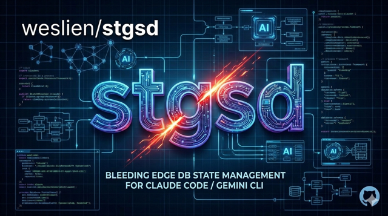

<p align="center">
  
</p>

# stgsd

A SpacetimeDB-backed replacement for [GSD](https://github.com/get-shit-done-ai/gsd)'s file-based state management in Claude Code. Instead of reading/writing markdown files in `.planning/` directories, GSD agents call a `stgsd` CLI that stores structured state in SpacetimeDB — giving Claude Code queryable, persistent memory that lives outside the repo.

## Why Not Markdown?

GSD stores all planning state as markdown files: `STATE.md`, `ROADMAP.md`, `PLAN.md`, phase directories, verification reports, research notes. This works, but creates friction:

| Problem with Markdown Files | stgsd Solution |
|---|---|
| **Parsing overhead** — Agents regex/grep through prose to extract state | **Typed schema** — Structured columns (u64, bool, timestamp) with JSON output |
| **File I/O bottleneck** — Every state read/write is a filesystem operation | **Single query** — SpacetimeDB returns exactly what's needed |
| **Repo pollution** — `.planning/` dirs accumulate dozens of state files | **Zero repo files** — All state lives in SpacetimeDB |
| **Fragile parsing** — Malformed YAML frontmatter or markdown breaks agents | **Schema validation** — Data validated at write time |
| **No cross-project memory** — Each repo is an island | **Shared database** — Query decisions and patterns across projects |
| **Race conditions** — Concurrent agents can clobber files | **Transactional** — SpacetimeDB reducers are atomic |
| **Manual cleanup** — Archiving completed milestones means moving files around | **Structured lifecycle** — Status fields and queries handle state transitions |

## Prerequisites

- **[Claude Code](https://docs.anthropic.com/en/docs/claude-code)** — Anthropic's CLI for Claude
- **[GSD](https://github.com/get-shit-done-ai/gsd)** — The planning/execution workflow that stgsd enhances
- **[SpacetimeDB CLI](https://spacetimedb.com/install)** — `spacetime` binary
- **[Node.js 22+](https://nodejs.org/)** — Runtime for the CLI tool
- **Git** — Working repository with an `origin` remote
- **SpacetimeDB account** — Free account on [maincloud](https://spacetimedb.com) (or a local server)

## Quick Start (Inside Claude Code)

Two steps: **install** (once, in this repo) and **use** (in any project repo).

### Step 1: Install — run in this repo

Clone this repo, open Claude Code inside it, and run:

```
/setup-stgsd
```

This is the only command you run in the stgsd repo. It's idempotent and handles everything:
- Builds and installs the `stgsd` CLI to `~/.claude/bin/`
- Copies the `/stgsd:*` slash commands so they're available globally
- Ensures SpacetimeDB is running and the module is published
- Verifies the connection works

After this, you're done with the stgsd repo. Everything below happens in your **project repos**.

### Step 2: Use — run in your project repo

Open Claude Code in any git repo where you want SpacetimeDB-backed planning.

**For an existing GSD project** (has `.planning/` files):

```
/stgsd:setup
/stgsd:seed
```

`/stgsd:setup` provisions a SpacetimeDB database for this repo. `/stgsd:seed` reads your existing `PROJECT.md` and `ROADMAP.md` and imports all project metadata, phases, and requirements into SpacetimeDB.

**For a new project** (no existing `.planning/` files):

```
/stgsd:setup
```

When you start planning with `/gsd:new-project` or `/gsd:plan-phase`, the patched GSD agents will write state directly to SpacetimeDB — no seed needed.

### Day-to-day workflow

Once set up, you use GSD exactly as before. The patched agents handle SpacetimeDB automatically:

| GSD Command | What happens under the hood |
|---|---|
| `/gsd:progress` | Reads state from SpacetimeDB via `stgsd` |
| `/gsd:plan-phase` | Planner gets context from `stgsd init plan-phase`, writes plans via `stgsd write-plan` |
| `/gsd:execute-phase` | Executor loads plans from SpacetimeDB, writes summaries via `stgsd write-summary` |
| `/gsd:verify-work` | Verifier reads plans/summaries from SpacetimeDB, writes results via `stgsd write-verification` |

You can also query state directly:

```
/stgsd:status                   # Current phase, plan, last activity
/stgsd:get-state                # Full project state with velocity data
/stgsd:roadmap                  # Phase overview with completion states
/stgsd:get-phase 3              # Phase details with requirements and plans
/stgsd:read-plan 3 1            # Read a specific plan's content
```

## Manual Installation

If you prefer to install without Claude Code, or need to customize the setup:

### 1. Clone and install dependencies

```bash
git clone https://github.com/weslien/stgsd.git
cd stgsd
npm install
```

### 2. Set up SpacetimeDB

```bash
# Option A: Use maincloud (recommended, free)
spacetime login

# Option B: Run locally
spacetime start
```

### 3. Publish the module

```bash
# To maincloud (uses default server)
spacetime publish stgsd --module-path spacetimedb

# Or to local server
spacetime publish stgsd --module-path spacetimedb --server local
```

### 4. Generate client bindings

```bash
npm run spacetime:generate
```

### 5. Build and install the CLI

```bash
npm run install:cli
```

Installs `stgsd` to `~/.claude/bin/` (already on Claude Code's PATH) and copies the SpacetimeDB module source for per-repo database provisioning.

### 6. Install slash commands

```bash
cp -r .claude/global-commands/stgsd ~/.claude/global-commands/stgsd
```

### 7. Set up a project repo

From any git repo you want to manage:

```bash
stgsd setup
stgsd seed --name "My Project" --description "..." --core-value "..." \
  --phases-json '[...]' --requirements-json '[...]'
```

## Slash Command Reference

All `/stgsd:*` commands are used in your **project repos**, not in this repo.

**Status & Queries**
| Command | Description |
|---|---|
| `/stgsd:status` | Show current project status (phase, plan, last activity) |
| `/stgsd:get-state` | Full project state with velocity and session data |
| `/stgsd:get-phase` | Phase details with linked plans and requirements |
| `/stgsd:read-plan` | Read plan content and metadata |
| `/stgsd:roadmap` | Phase overview with completion states |

**Workflow Assembly**
| Command | Description |
|---|---|
| `/stgsd:init` | Assemble workflow context (progress, plan-phase, execute-phase) |

**Write Operations**
| Command | Description |
|---|---|
| `/stgsd:write-plan` | Persist a plan to SpacetimeDB |
| `/stgsd:write-summary` | Persist plan execution summary |
| `/stgsd:write-verification` | Persist phase verification result |
| `/stgsd:write-research` | Persist phase research findings |
| `/stgsd:write-context` | Persist phase context (user decisions) |

**State Mutations**
| Command | Description |
|---|---|
| `/stgsd:update-progress` | Update current phase/plan/task position |
| `/stgsd:advance-plan` | Advance to next plan in current phase |
| `/stgsd:complete-phase` | Mark phase complete, advance project state |
| `/stgsd:record-metric` | Record a velocity metric |
| `/stgsd:mark-requirement` | Mark requirements as complete |

**Setup** (run once per project repo)
| Command | Description |
|---|---|
| `/stgsd:setup` | Provision a SpacetimeDB database for this repo |
| `/stgsd:seed` | Bootstrap project data from existing `.planning/` files |

### CLI Direct Usage

The `stgsd` CLI has 35 commands and can be called directly from the terminal. In addition to the slash commands above, the CLI includes commands for milestones, sessions, todos, debug sessions, codebase maps, and phase management:

```bash
stgsd status                    # Current project status
stgsd get-state --json          # Full state (JSON)
stgsd roadmap                   # Phase overview
stgsd get-phase 3               # Phase details
stgsd read-plan 3 1             # Read a specific plan

# Phase management
stgsd add-phase                 # Append phase to roadmap
stgsd insert-phase              # Insert phase between existing ones
stgsd remove-phase              # Remove a phase

# Milestones
stgsd get-milestones            # List milestones
stgsd write-milestone           # Create/update milestone
stgsd write-audit               # Write milestone audit

# Session management
stgsd write-session             # Save session checkpoint
stgsd get-session               # Restore session state

# Todos
stgsd add-todo                  # Capture a todo
stgsd list-todos                # List pending todos
stgsd complete-todo             # Mark todo done

# Debug sessions
stgsd write-debug               # Save debug session state
stgsd get-debug                 # Restore debug session
stgsd close-debug               # Close debug session

# Codebase maps
stgsd write-codebase-map        # Store codebase analysis
stgsd get-codebase-map          # Retrieve codebase map
```

All commands support `--json` for machine-readable output.

## How It Works

### Architecture

```
┌─────────────────┐     ┌──────────────┐     ┌──────────────────┐
│  GSD Agents     │     │  stgsd       │     │  SpacetimeDB     │
│  (patched .md)  │────▶│  CLI         │────▶│  (maincloud)     │
│                 │     │              │     │                  │
│  - executor     │     │  35 commands │     │  19 tables       │
│  - planner      │     │  JSON output │     │  53 reducers     │
│  - verifier     │     │  git identity│     │                  │
└─────────────────┘     └──────────────┘     └──────────────────┘
```

1. **SpacetimeDB module** defines 19 tables (project, phase, plan, task, requirement, state, milestone, session, todo, debug, codebase, etc.) with 53 reducers
2. **`stgsd` CLI** auto-detects the current project via git remote URL, connects to SpacetimeDB, and executes queries/mutations
3. **GSD agent patches** replace file I/O calls in `gsd-executor.md`, `gsd-planner.md`, and `gsd-verifier.md` with `stgsd` commands
4. **Slash commands** provide the interface for Claude Code, calling the CLI with proper context

### Project Identity

Projects are identified by git remote URL — no manual configuration needed. When you run `stgsd` in any git repo, it reads the `origin` remote and looks up (or creates) the matching project in SpacetimeDB.

### Per-Repo Configuration

Each repo's config is stored at `~/.claude/stgsd/{repoId}/config.json`:

```json
{
  "uri": "wss://maincloud.spacetimedb.com",
  "database": "stgsd-abc123",
  "module-path": "~/.claude/stgsd/module"
}
```

## Managing GSD Updates

stgsd patches three GSD agent files to use `stgsd` instead of file I/O. These patches are designed to survive GSD updates.

### How patches work

1. Patches are minimal, targeted text replacements (not full file rewrites)
2. GSD tracks file hashes in `gsd-file-manifest.json`
3. When you run `/gsd:update`, GSD detects modified files and backs them up to `~/.claude/gsd-local-patches/`

### After a GSD update

```
/gsd:reapply-patches
```

GSD detects your patches and backs them up automatically. Run the above to reapply after updating.

If a patch fails to merge cleanly (due to major GSD restructuring), you'll need to manually re-apply the changes. The patches are small — they replace specific `gsd-tools.cjs` calls with `stgsd` equivalents.

### Patched files

| File | What Changed |
|---|---|
| `gsd-executor.md` | State reads/writes and summary creation use `stgsd` |
| `gsd-planner.md` | Context loaded from `stgsd init plan-phase`, plans written via `stgsd write-plan` |
| `gsd-verifier.md` | Plans/summaries read from `stgsd`, verification results written back |

## Project Structure

```
stgsd/
├── spacetimedb/              # SpacetimeDB module (backend)
│   └── src/
│       ├── schema.ts         # 19 table definitions
│       └── index.ts          # 53 reducers and lifecycle hooks
├── src/                      # CLI tool
│   └── cli/
│       ├── index.ts          # Commander.js entry point
│       ├── commands/         # 35 command implementations
│       └── lib/              # Connection, git, output helpers
├── .claude/
│   ├── commands/
│   │   └── setup-stgsd.md   # Bootstrap command (run in this repo)
│   └── global-commands/
│       └── stgsd/            # 18 slash commands (installed globally)
└── .planning/                # GSD roadmap (for this project itself)
```

## Roadmap: GSD Coverage

### v1.0 — Core Loop (shipped)

The core planning/execution loop that runs every session:

| GSD Command | Status | What stgsd handles |
|---|---|---|
| `/gsd:progress` | **Patched** | State, roadmap, and activity read from SpacetimeDB |
| `/gsd:plan-phase` | **Patched** | Context assembly, research, plan writing all via stgsd |
| `/gsd:execute-phase` | **Patched** | Plan loading, summary writing, phase completion |
| `/gsd:verify-work` | **Patched** | Plan/summary reads, verification result writing |

Patched agent files: `gsd-executor.md`, `gsd-planner.md`, `gsd-verifier.md`

### v1.x — Extended Coverage (CLI-ready)

These features have CLI commands and backend tables but don't yet have slash commands or GSD agent patches:

| Feature | CLI Commands | Status |
|---|---|---|
| Milestone lifecycle | `get-milestones`, `write-milestone`, `write-audit` | CLI only |
| Session management | `write-session`, `get-session` | CLI only |
| Phase management | `add-phase`, `insert-phase`, `remove-phase` | CLI only |
| Todo tracking | `add-todo`, `list-todos`, `complete-todo` | CLI only |
| Debug sessions | `write-debug`, `get-debug`, `close-debug` | CLI only |
| Codebase maps | `write-codebase-map`, `get-codebase-map` | CLI only |

### Not Yet Covered

These GSD workflows still use file-based `.planning/` state and have no stgsd equivalent yet:

| GSD Command | What it does |
|---|---|
| `/gsd:new-project` | Initialize project with research and roadmap |
| `/gsd:list-phase-assumptions` | Surface Claude's assumptions before planning |
| `/gsd:add-tests` | Generate tests for completed phase |
| `/gsd:health` | Diagnose planning directory issues |
| `/gsd:cleanup` | Archive old phase directories |

**Config & Meta** (no state migration needed): `/gsd:settings`, `/gsd:set-profile`, `/gsd:update`, `/gsd:reapply-patches`, `/gsd:help`

### v2 — Planned

| Feature | Priority |
|---|---|
| Slash commands + GSD patches for v1.x features | High |
| Cross-project memory and patterns | Future |
| Multi-agent coordination via subscriptions | Future |

## Troubleshooting

**`stgsd: command not found`**
- Run `npm run install:cli` to install to `~/.claude/bin/`
- Ensure `~/.claude/bin` is on your PATH

**`PROJECT_NOT_FOUND`**
- Run `/stgsd:seed` or `stgsd seed` to bootstrap the project
- Verify your repo has an `origin` remote: `git remote -v`

**Connection timeout**
- Check SpacetimeDB is running: `spacetime start` (local) or verify maincloud status
- Check your config: `cat ~/.claude/stgsd/*/config.json`

**Slash commands not available**
- Run `/setup-stgsd` in this repo, or manually copy: `cp -r .claude/global-commands/stgsd ~/.claude/global-commands/stgsd`

**SpacetimeDB module errors**
- Check logs: `spacetime logs stgsd`
- Republish: `spacetime publish stgsd --clear-database -y --module-path spacetimedb`

## License

MIT
